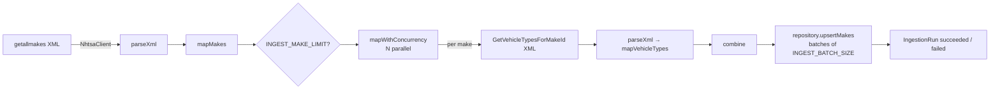
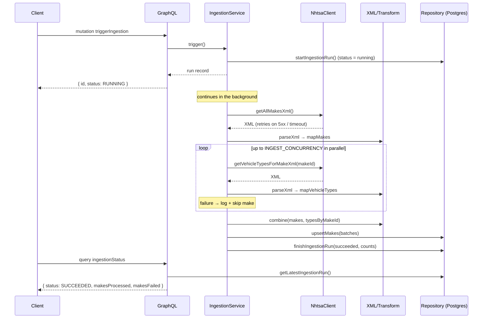

# Architecture

## Layers

```
┌───────────────────────────────────────────────────────────────┐
│ presentation   src/app.ts, src/graphql/*    Express + Apollo    │
├───────────────────────────────────────────────────────────────┤
│ application    src/ingestion/*              pipeline orchestration │
├───────────────────────────────────────────────────────────────┤
│ domain         src/domain/*                 types, errors, pure transforms, repository port │
├───────────────────────────────────────────────────────────────┤
│ infrastructure src/infrastructure/*         HTTP client, XML parser, Prisma repository, logging │
└───────────────────────────────────────────────────────────────┘
```

Dependencies point inwards: infrastructure and presentation depend on the domain, never the other
way round. The domain defines the `VehicleRepository` port; `PrismaVehicleRepository` implements it
for PostgreSQL and `InMemoryVehicleRepository` implements it for tests. Everything is wired
together in `src/main.ts` by plain constructor injection.

## Ingestion pipeline





### Steps

1. **Fetch makes.** One request to `getallmakes?format=XML` (~12,400 records).
2. **Parse + transform.** `fast-xml-parser` with `isArray` for the repeating elements, so a single
   result is still a list. Values are kept as strings; `mapMakes` validates each item with Zod and
   coerces ids to integers, trims names, and de-duplicates by id.
3. **Fan out.** `mapWithConcurrency` runs `GetVehicleTypesForMakeId/{id}` for every make with at
   most `INGEST_CONCURRENCY` requests in flight. Each make is isolated: a failure is logged with
   the make id and counted, and the pipeline continues. Progress is logged every 500 makes.
4. **Combine.** `combine` produces the unified `[{ makeId, makeName, vehicleTypes: [...] }]`
   structure. Makes whose vehicle types could not be fetched are omitted rather than stored with
   an empty list.
5. **Persist.** Batches of `INGEST_BATCH_SIZE` makes are written in one transaction each using
   set-based SQL (`unnest` + `ON CONFLICT DO UPDATE`); the make's previous vehicle-type links are
   replaced so removed types disappear. The whole operation is idempotent.
6. **Record the run.** An `IngestionRun` row tracks status, timestamps and counts. It powers the
   `ingestionStatus` query and the "ingest on startup only if empty" behaviour.

### Concurrency & safety

- Only one run may be active per process. `IngestionService.startIfIdle` assigns the active-run
  promise synchronously before any `await`, so concurrent `triggerIngestion` calls cannot race.
- The run executes off the request path; `triggerIngestion` returns as soon as the run row exists.
- A run where *every* make fails is marked `FAILED` (with a message) instead of `SUCCEEDED` with
  zero rows.

### Performance notes

The dominant cost is ~12,400 upstream HTTP requests. With `INGEST_CONCURRENCY=10` and typical
NHTSA latency the crawl takes a few minutes; raising concurrency helps until the upstream API
starts returning 429/5xx, which the client backs off from automatically. Database writes are a
small fraction of the run: ~25 transactions of 500 makes, each doing four set-based statements.

## Error handling

All failures are represented by a small typed hierarchy in `src/domain/errors.ts`. Every error
carries a machine-readable `code`, an optional `cause` (the original error) and `context`
(ids, URLs, statuses) so log lines are actionable.

| Situation                                   | Error               | Behaviour                                                                                   |
| ------------------------------------------- | ------------------- | ------------------------------------------------------------------------------------------- |
| Network failure, timeout, 429, 5xx          | `ExternalApiError`  | Retried with exponential backoff + jitter (`HTTP_RETRIES`), then surfaced                    |
| 4xx other than 429                          | `ExternalApiError`  | Not retried (the request itself is wrong)                                                   |
| Empty / malformed XML                       | `XmlParseError`     | Includes line/column from the validator                                                     |
| XML parsed but shape unexpected / bad item  | `TransformError`    | Includes Zod issues and item index                                                          |
| Database write/read failure                 | `PersistenceError`  | Wraps the Prisma error; batch transaction rolls back                                        |
| Invalid environment                         | `ConfigError`       | Process exits at startup with every issue listed                                            |

Where each is handled:

- **Per make** (vehicle-type fetch/parse/transform): caught inside the fan-out, logged at `warn`
  with `makeId`/`makeName`, counted in `makesFailed`. One bad make never aborts the run.
- **Per run** (makes fetch, persistence, or all makes failing): caught in `IngestionService`,
  logged at `error`, and recorded on the `IngestionRun` row as `FAILED` with `errorMessage`.
- **GraphQL**: argument validation throws `GraphQLError` with `BAD_USER_INPUT`; resolver
  exceptions are logged by `formatError` and masked as `Internal server error` in production.
- **HTTP**: a JSON 404 for unknown routes and a JSON 500 handler as the last resort.
- **Process**: `unhandledRejection` triggers a graceful shutdown; `uncaughtException` logs at
  `fatal` and exits. `SIGINT`/`SIGTERM` close the HTTP server, stop Apollo and disconnect Prisma,
  with a 10-second force-exit timeout.

## Logging

Pino, JSON to stdout, one line per event. In `development` the output is piped through
`pino-pretty`; everywhere else it is raw JSON for log shippers.

- Base fields: `level`, `time` (ISO), `service`, plus `module` from a child logger per component
  (`http`, `nhtsa-client`, `ingestion`, `prisma`) and `runId` inside an ingestion run.
- Errors are passed under the `err` key so Pino serialises `name`, `message`, `stack` and `cause`.
- Explicitly logged events:
  - startup (`Starting vehicle-data-service`, `Database connection established`,
    `Server started` with port) and shutdown (`Shutdown requested` with the signal,
    `Shutdown complete`)
  - every failed upstream request (`warn` on retry, `error` when giving up)
  - transformation/parse failures per make (`warn`) and run-level failures (`error`)
  - unexpected exceptions (`fatal`)
  - HTTP requests via `pino-http` (method, url, status, response time; `/health` excluded; level
    escalates to `warn` for 4xx and `error` for 5xx)
- Level is controlled by `LOG_LEVEL`.

Example (production, JSON):

```json
{"level":"info","time":"2026-09-10T00:02:31.698Z","service":"vehicle-data-service","module":"ingestion","runId":1,"makesProcessed":40,"makesFailed":0,"durationMs":12712,"msg":"Ingestion finished"}
```

## Configuration

- Source of truth is the environment. `src/config/schema.ts` is a Zod object schema; `loadConfig()`
  parses `process.env` (empty strings treated as unset), applies defaults and coercion, and throws
  a `ConfigError` listing every invalid variable. The rest of the code receives a typed `AppConfig`
  and never reads `process.env` directly.
- Environments: `NODE_ENV` switches pretty logging and the GraphQL landing page; tests build
  components directly with explicit options and never touch the environment.
- `.env.example` documents every variable; `docker-compose.yml` sets production values and lets
  `INGEST_*`, `LOG_LEVEL` and `DB_PORT` be overridden from the shell or `.env`.
- Feature flag: `INGEST_ON_STARTUP`.

## Persistence design

```
Make ──< MakeVehicleType >── VehicleType        IngestionRun
```

- Natural keys from NHTSA (`Make_ID`, `VehicleTypeId`) are the primary keys → idempotent upserts.
- `Make.name` is indexed for the `search` argument (`ILIKE`-style `contains`, case-insensitive).
- `MakeVehicleType` has a composite primary key and an index on `vehicleTypeId`.
- Reads use Prisma's query builder with `include` so a page of makes and their types is two
  queries (rows + count) in one transaction — no N+1 per make.
- Writes bypass the row-by-row ORM path in favour of `unnest`-based bulk statements inside a
  transaction per batch; a failed batch rolls back atomically and surfaces as `PersistenceError`.

## Testing strategy

- Pure transforms and the concurrency helper: exhaustive unit tests, no I/O.
- `NhtsaClient`: injected `fetch`/`sleep`/`random` so retry timing and jitter are asserted
  deterministically without network.
- `IngestionService`: fake data source + in-memory repository; verifies skipping, failure
  classification, limits, and the single-active-run guard (including concurrent triggers).
- HTTP/GraphQL: supertest against the real Express/Apollo app with the in-memory repository.
- Repository: integration tests against real PostgreSQL (skipped when `TEST_DATABASE_URL` is
  absent; CI runs them against a service container).
